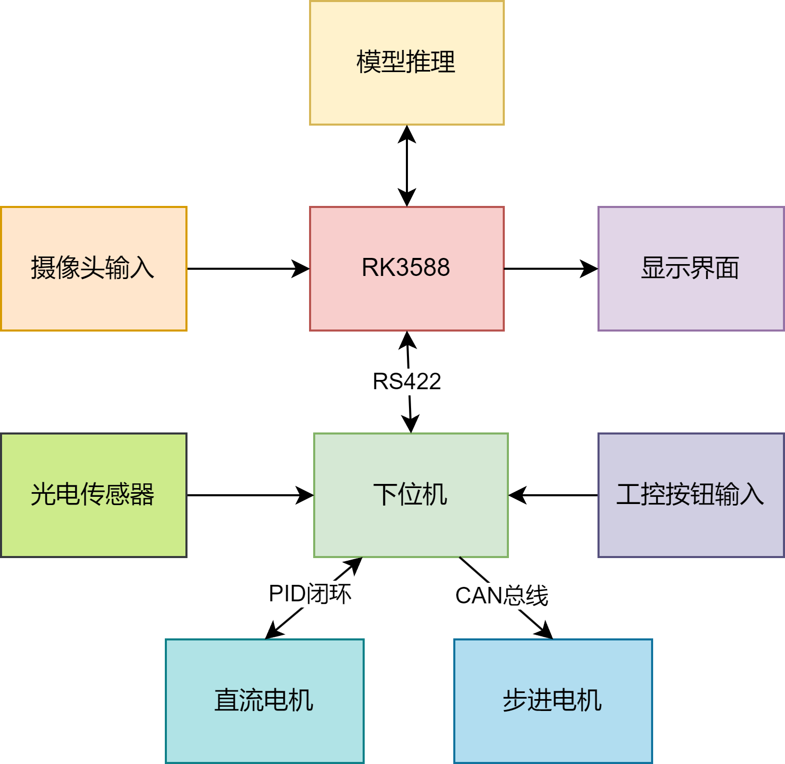
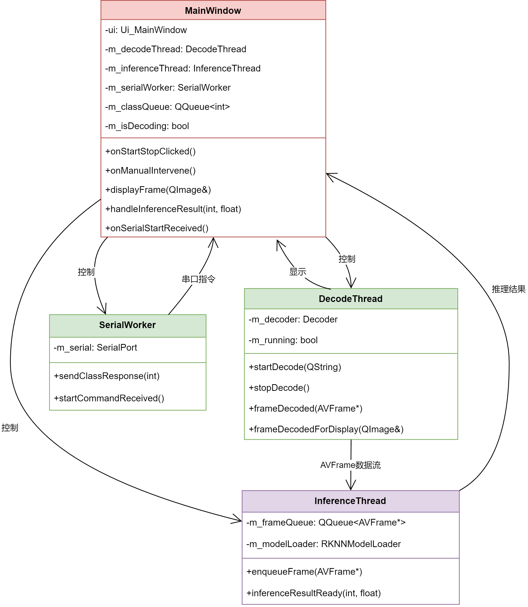
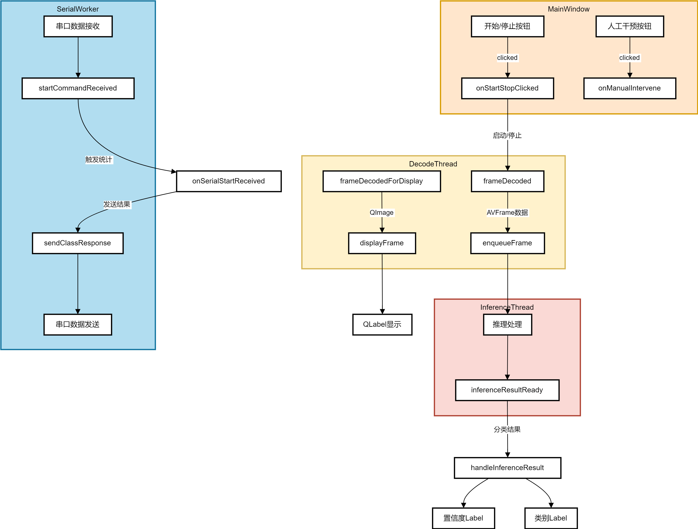
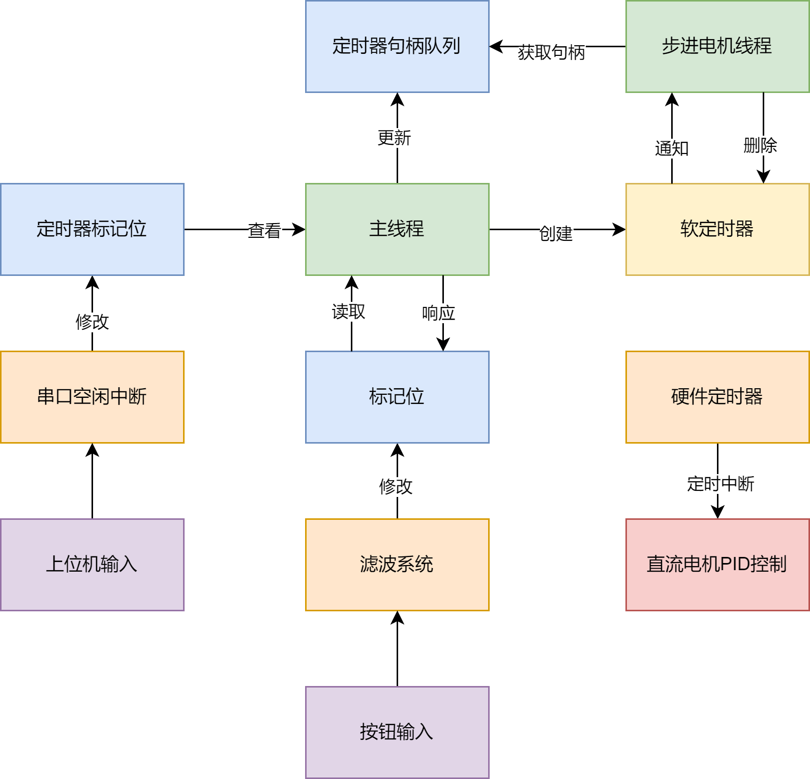

# ClamSelector-RK3588

## **2025年嵌入式系统设计竞赛瑞芯微赛道——智能蛏子筛选机**

## 项目简介

本项目是基于瑞芯微RK3588平台开发的智能蛏子筛选系统，通过计算机视觉和深度学习技术实现自动化蛏子品质检测与分拣。系统采用上下位机协同工作模式，上位机负责图像处理和AI推理，下位机负责机械控制和执行。

## 上位机设计

### 总体架构

上位机系统基于Qt框架开发，采用多线程并行处理架构：

- **视频解码**：使用MPP硬件解码器处理网络摄像头H.264视频流
- **图像处理**：利用RGA硬件加速器进行图像缩放和格式转换
- **AI推理**：通过RKNN在NPU上执行ResNet模型进行蛏子品质识别
- **通信控制**：监听串口通信，响应下位机请求并返回推理结果
- **用户界面**：实时显示视频流和检测结果

### 线程模型

系统采用生产者-消费者模式，各线程职责明确：
- **解码线程**：负责视频流解码
- **推理线程**：执行AI模型推理
- **显示线程**：处理GUI显示更新
- **通信线程**：处理串口数据交互

### 信号槽设计

采用Qt信号槽机制实现线程间异步通信，确保系统响应性和稳定性。

### 更多上位机相关详细信息
[编译上位机教程](./doc/build_software.md)
[解码系统介绍](./doc/decode.md)
[放缩系统介绍](./doc/scaler.md)
[推理系统介绍](./doc/infer.md)
[通信系统介绍](./doc/community.md)
[qt系统介绍](./doc/qt.md)

### 核心技术栈

- **[RK MPP](https://github.com/rockchip-linux/mpp)** - 瑞芯微多媒体处理平台，提供硬件编解码支持
- **[RK RGA](https://github.com/airockchip/librga)** - 瑞芯微2D图形加速库，用于高效图像处理
- **[Qt Framework](https://www.qt.io/)** - 跨平台C++应用程序开发框架
- **[FFmpeg-Rockchip](https://github.com/nyanmisaka/ffmpeg-rockchip)** - 针对瑞芯微硬件优化的FFmpeg版本
- **[rknn-toolkit](https://github.com/rockchip-linux/rknn-toolkit)** - rknn推理库

## 下位机设计

### 硬件平台

- **主控芯片**：STM32F407VET6 (Cortex-M4, 168MHz)

- **实时操作系统**：FreeRTOS

- **通信接口**：UART、CAN总线

- **控制对象**：步进电机、直流电机、气动执行器

### 系统流程

下位机采用多任务并发设计：

1. **主控任务**：协调各子系统，处理上位机指令
2. **电机控制任务**：精确控制传送带速度和分拣机构动作
3. **定时器队列**：实现并行延时等待、通知
4. **通信**：获取识别结果

### 核心功能

- **PID闭环控制**：确保传送带速度稳定
- **多轴运动控制**：协调分拣机构精确动作
- **实时响应**：毫秒级响应上位机分拣指令
- **故障检测**：实时监控系统运行状态

## 技术特色

✨ **硬件加速**：充分利用RK3588的NPU、GPU、VPU等专用处理单元

✨ **实时性能**：端到端延迟小于100ms，满足工业应用需求

✨ **高精度控制**：步进电机精度达到0.1mm，确保分拣准确性

✨ **模块化设计**：系统各模块解耦，便于维护和扩展

### 更多下位机相关详细信息
[编译下位机教程](./doc/build_hardware.md)

**🎯 项目目标**：通过AI+嵌入式技术，实现蛏子品质的智能化、自动化检测分拣，提升水产加工效率和品质控制水平。